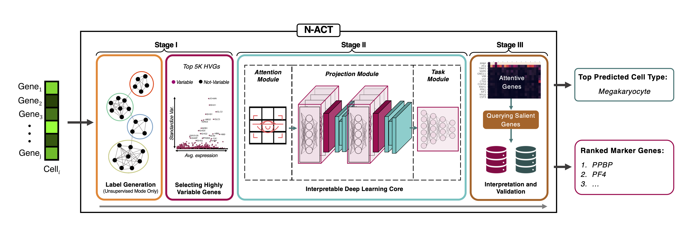

# N-ACT
The public repository [N-ACT: An Interpretable Deep Learning Model for Automatic Cell Type and Salient Gene Identification](https://icml-compbio.github.io/2022/papers/WCBICML2022_paper_18.pdf) (Accepted WCB@ICML2022 paper)

[](https://doi.org/10.48550/arXiv.2206.04047)




## Tutorials
TODO


## Installation:

#### Install Package Locally
Make sure to be in the same directory as `setup.py`. Then, using `pip`, run:

````bash
pip install -e .
````

In the case that you want to install the requirements explicitly, you can do so by:

````bash
pip install -r requirements.txt
````
Although the core requirements are listed directly in `setup.py`. Nonetheless, it is good to run this beforehand in case of any dependecies conflicts.


## Citation

Please cite our repository if it was useful for your research:
````
@article {Heydari2022.05.12.491682,
	author = {Heydari, A. Ali and Davalos, Oscar A. and Hoyer, Katrina K. and Sindi, Suzanne S.},
	title = {N-ACT: An Interpretable Deep Learning Model for Automatic Cell Type and Salient Gene Identification},
	elocation-id = {2022.05.12.491682},
	year = {2022},
	doi = {10.1101/2022.05.12.491682},
	journal = {The 2022 International Conference on Machine Learning (ICML) Workshop on Computational Biology Proceedings.},
	URL = {https://www.biorxiv.org/content/early/2022/05/13/2022.05.12.491682},
	eprint = {https://www.biorxiv.org/content/early/2022/05/13/2022.05.12.491682.full.pdf},
}
````
